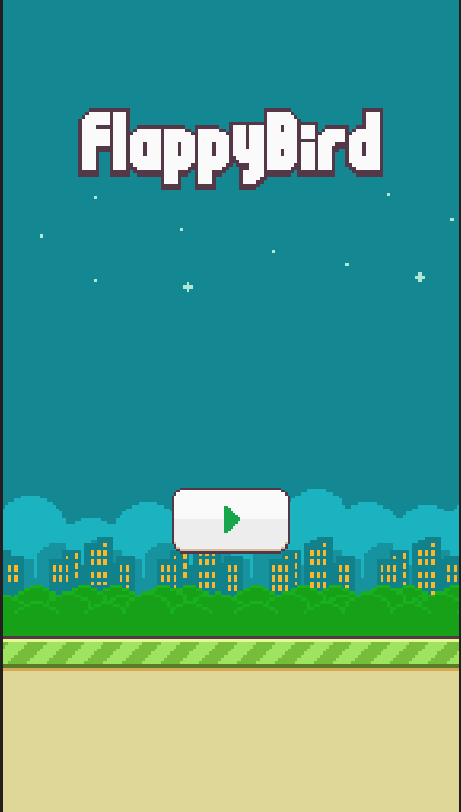
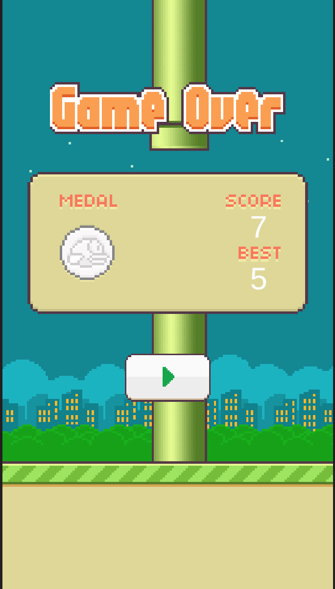

# FloppyBird

A Flappy Bird clone built with Unity.

## Screenshots

## Gameplay

## How to play

1. Extract `FloppyBird.zip`
2. Run `FloppyBird.exe`
3. Press **Space** (or click) to flap, avoid the pipes!

## Built with

- [Unity](https://unity.com/)
- Sprites from [The Spriters Resource](https://www.spriters-resource.com/mobile/flappybird/asset/59894/)

## Author

Jules Goy
